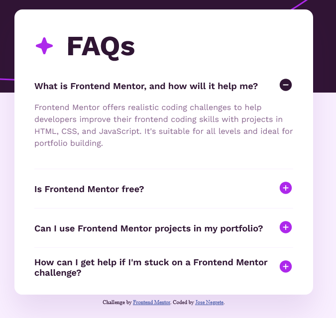

# Frontend Mentor - FAQ accordion solution

This is a solution to the [FAQ accordion challenge on Frontend Mentor](https://www.frontendmentor.io/challenges/faq-accordion-wyfFdeBwBz). Frontend Mentor challenges help you improve your coding skills by building realistic projects. 

## Table of contents

- [Overview](#overview)
  - [The challenge](#the-challenge)
  - [Screenshot](#screenshot)
  - [Links](#links)
- [My process](#my-process)
  - [Built with](#built-with)
  - [What I learned](#what-i-learned)
  - [Continued development](#continued-development)
  - [Useful resources](#useful-resources)
- [Author](#author)

## Overview

### The challenge

Users should be able to:

- Hide/Show the answer to a question when the question is clicked
- Navigate the questions and hide/show answers using keyboard navigation alone
- View the optimal layout for the interface depending on their device's screen size
- See hover and focus states for all interactive elements on the page

### Screenshot



### Links

- Solution URL: (https://www.frontendmentor.io/solutions/faq-accordion-solution-using-html-and-css-DtkUJdXC3L)
- Live Site URL: (https://josenegrete123.github.io/FAQ-Accordion-Project/)

## My process

### Built with

- Semantic HTML5 markup
- CSS custom properties
- Flexbox

### What I learned

Main thing I learned was using the @media in CSS for the mobile portion of the challenge. Also learned how to use the details html as well as how to manipulate the marker. 

```html
<details class="card__details__body">
            <summary>What is Frontend Mentor, and how will it help me?</summary>
            <p>Frontend Mentor offers realistic coding challenges to help developers improve their 
              frontend coding skills with projects in HTML, CSS, and JavaScript. It's suitable for 
              all levels and ideal for portfolio building.</p>
</details>
```
```css
@media (max-width: 375px) {
    .body-image {
        content: url("./assets/images/background-pattern-mobile.svg");
        width: auto;
        height: 232px;
        position: absolute;
        left: 0px;
        top: 0px;
    }
}
```
### Continued development

For the future I want to learn better on how to use the @media CSS and also which code to include and exclude inside of there. Also would like to try using JavaScript.

### Useful resources

- [Make Summary HTML into a Flexbox](https://stackoverflow.com/questions/40207061/flexbox-doesnt-work-in-summary-tag) - This helped me create a flexbox with the summary tag, which in turn helped me create the marker at the end.
- [CSS Media Query](https://www.youtube.com/watch?v=yU7jJ3NbPdA) - This video helped me understand how to use the @media in CSS and how to implement it to have different dimensions for mobile users.

## Author

- Website - [Jose Negrete](https://github.com/josenegrete123)
- Frontend Mentor - [@josenegrete123](https://www.frontendmentor.io/profile/josenegrete123)